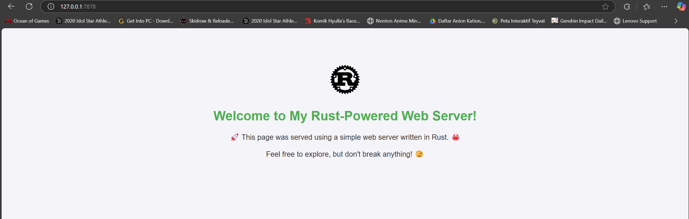
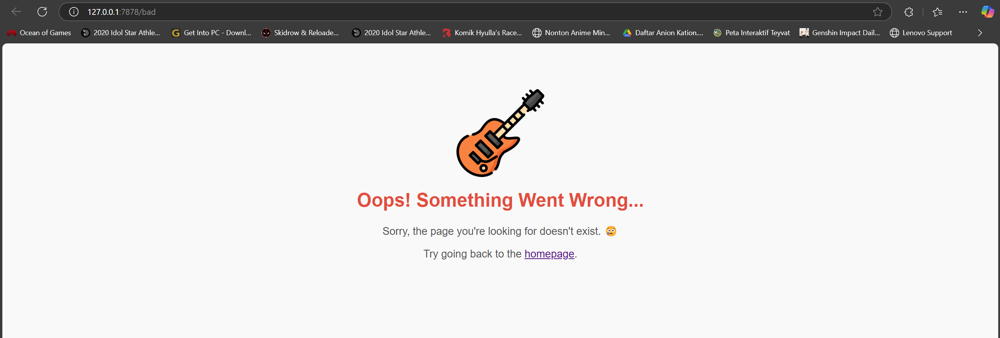

# Reflection on Module 6

<details>
<summary><b>Milestone 1</b></summary>

## Milestone 1 Reflection

### Commit 1 Reflection Notes

#### handle_connection Function Analysis
- Uses `BufReader` to efficiently read data from the TCP stream
- Reads lines until an empty line is encountered (end of HTTP request header)
- Collects request lines into a vector for inspection

#### HTTP Request Structure
Typical request contains:
- Method (GET)
- Path (/)
- HTTP version
- Headers (Host, User-Agent, Accept, etc.)
- Followed by empty line

#### Key Rust Concepts Demonstrated
- TcpListener/TcpStream for network communication
- Error handling with `.unwrap()` (for simplicity)
- Iterator processing with `map()` and `take_while()`
- Buffering with BufReader for efficient IO

</details>

<details>
<summary><b>Milestone 2</b></summary>

## Milestone 2 Reflection

### Commit 2 Reflection Notes

#### Perubahan pada `handle_connection`
- **Membaca File HTML**: Menggunakan `fs::read_to_string` untuk membaca konten `hello.html`
- **Format Respons HTTP**:
    - Status Line: `HTTP/1.1 200 OK` (kode sukses)
    - Header `Content-Length`: Menyatakan ukuran konten dalam byte
    - Pemisah header dan body: `\r\n\r\n`
- **Mengirim Respons**: Menggunakan `stream.write_all` untuk mengirim data ke browser

#### Struktur Respons HTTP
HTTP/1.1 200 OK
Content-Length: 143

Isi HTML:
```HTML
<!DOCTYPE html>
<html lang="en">
<head>
    <meta charset="utf-8">
    <title>Hello!</title> </head> <body>
<h1>Hello!</h1> <p>Hi from Rust, running from Belva's machine.</p>
</body>
</html>
```

#### Screenshot


</details>

<details>
<summary><b>Milestone 3</b></summary>

## Milestone 3 Reflection

### Commit 3 Reflection Notes

#### Validasi Request dan Respons Selektif
- **Validasi Request**: Memeriksa apakah URL yang diminta adalah `/` menggunakan `if-else`.
- **Respons Dinamis**:
  - Jika URL adalah `/`, kirim `hello.html` dengan status `HTTP/1.1 200 OK`.
  - Jika URL lain, kirim `404.html` dengan status `HTTP/1.1 404 NOT FOUND`.
- **Desain Kreatif**:
  - Halaman utama (`hello.html`) menggunakan logo Rust, animasi CSS, dan tampilan modern.
  - Halaman error (`404.html`) menampilkan ikon error dan pesan interaktif.

#### Perubahan Kode
```rust
// Potongan kode handle_connection
if request_line == "GET / HTTP/1.1" {
  let status_line = "HTTP/1.1 200 OK";
  let contents = fs::read_to_string("hello.html").unwrap();
  let length = contents.len();
  
  let response = format!(
  "{status_line}\r\nContent-Length: {length}\r\n\r\n{contents}"
  );
  
  stream.write_all(response.as_bytes()).unwrap();
} else {
  let status_line = "HTTP/1.1 404 NOT FOUND";
  let contents = fs::read_to_string("404.html").unwrap();
  let length = contents.len();
  
  let response = format!(
  "{status_line}\r\nContent-Length: {length}\r\n\r\n{contents}"
  );
  
  stream.write_all(response.as_bytes()).unwrap();
}
```

#### Key Improvements
- **Error Handling** : Menangani permintaan tidak valid dengan halaman khusus.
- **Code Structure** : Memisahkan logika penentuan respons ke dalam tuple (status_line, filename).
- **User Experience** : Desain HTML yang lebih ramah pengguna dengan CSS styling.
Screenshot

#### Screenshot



</details>

<details>
<summary><b>Milestone 4</b></summary>

## Milestone 4 Reflection

### Commit 4 Reflection Notes

#### Simulasi Respons Lambat
- **Tujuan**: Memahami keterbatasan server single-threaded dengan mensimulasikan request yang membutuhkan waktu lama.
- **Simulasi**:
  - Menambahkan endpoint `/sleep` yang menunda respons selama 10 detik menggunakan `thread::sleep`.
  - Ketika `/sleep` diakses, semua request lain harus menunggu hingga delay selesai.

#### Observasi
- **Blocking Behavior**:
  - Akses ke `http://127.0.0.1:7878/sleep` menyebabkan request ke `http://127.0.0.1:7878/` **tertunda selama 10 detik**.
  - Server tidak bisa menangani multiple request secara paralel karena hanya memiliki satu thread.

#### Kode Kritis
```rust
"GET /sleep HTTP/1.1" => {
    thread::sleep(Duration::from_secs(10)); // Simulasi operasi yang lama
    ("HTTP/1.1 200 OK", "hello.html")
}
```

#### Implikasi di Dunia Nyata
- Server single-threaded tidak cocok untuk aplikasi yang membutuhkan skalabilitas.
- Request yang memakan waktu lama (misalnya: operasi database, API eksternal) akan memblokir semua user lain.

#### Solusi yang Mungkin
- **Multi-Threading** : Membuat thread baru untuk setiap request.
- **Asynchronous Programming** : Menggunakan async/await untuk menangani request secara non-blocking.

</details>