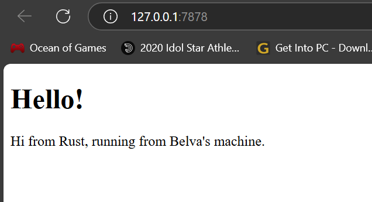

# Reflection on Module 6

<details>
<summary><b>Milestone 1</b></summary>

## Milestone 1 Reflection

### Commit 1 Reflection Notes

#### handle_connection Function Analysis
- Uses `BufReader` to efficiently read data from the TCP stream
- Reads lines until an empty line is encountered (end of HTTP request header)
- Collects request lines into a vector for inspection

#### HTTP Request Structure
Typical request contains:
- Method (GET)
- Path (/)
- HTTP version
- Headers (Host, User-Agent, Accept, etc.)
- Followed by empty line

#### Key Rust Concepts Demonstrated
- TcpListener/TcpStream for network communication
- Error handling with `.unwrap()` (for simplicity)
- Iterator processing with `map()` and `take_while()`
- Buffering with BufReader for efficient IO

</details>

<details>
<summary><b>Milestone 2</b></summary>

## Milestone 2 Reflection

### Commit 2 Reflection Notes

#### Perubahan pada `handle_connection`
- **Membaca File HTML**: Menggunakan `fs::read_to_string` untuk membaca konten `hello.html`
- **Format Respons HTTP**:
    - Status Line: `HTTP/1.1 200 OK` (kode sukses)
    - Header `Content-Length`: Menyatakan ukuran konten dalam byte
    - Pemisah header dan body: `\r\n\r\n`
- **Mengirim Respons**: Menggunakan `stream.write_all` untuk mengirim data ke browser

#### Struktur Respons HTTP
HTTP/1.1 200 OK
Content-Length: 143

Isi HTML:
```
<!DOCTYPE html>
<html lang="en">
<head>
    <meta charset="utf-8">
    <title>Hello!</title> </head> <body>
<h1>Hello!</h1> <p>Hi from Rust, running from Belva's machine.</p>
</body>
</html>
```

#### Screenshot


</details>